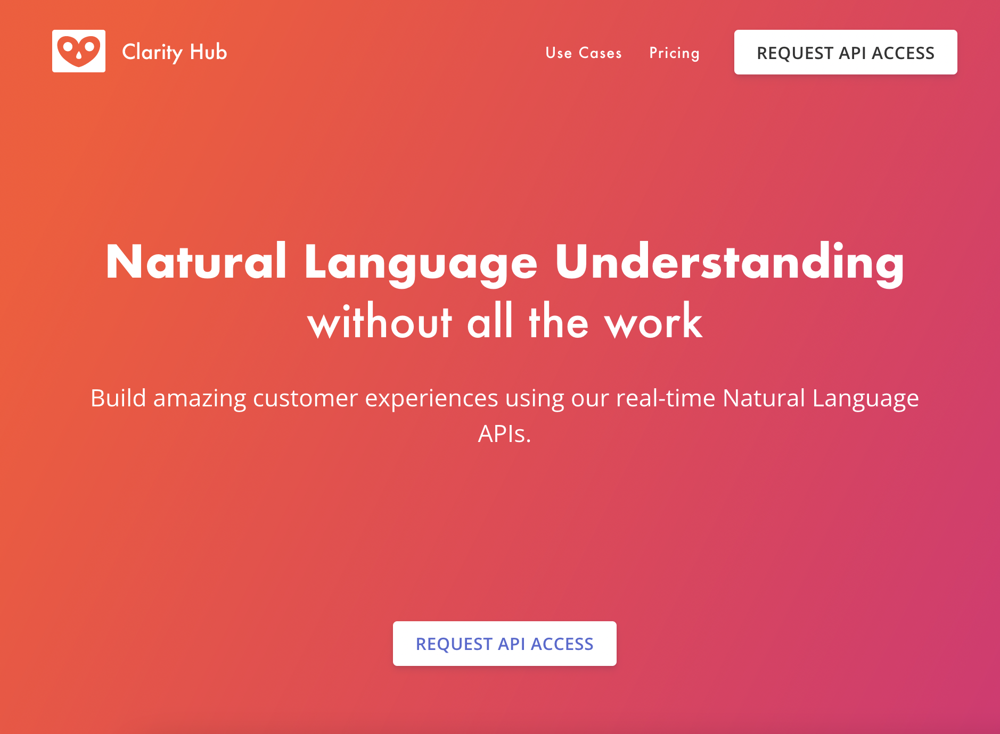
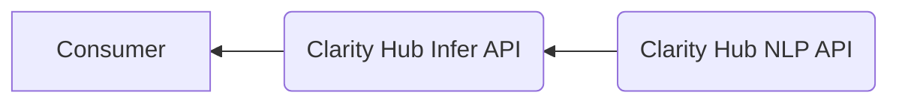
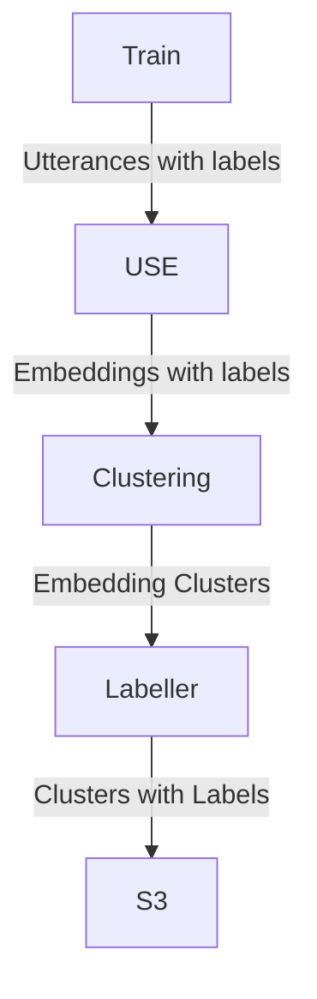
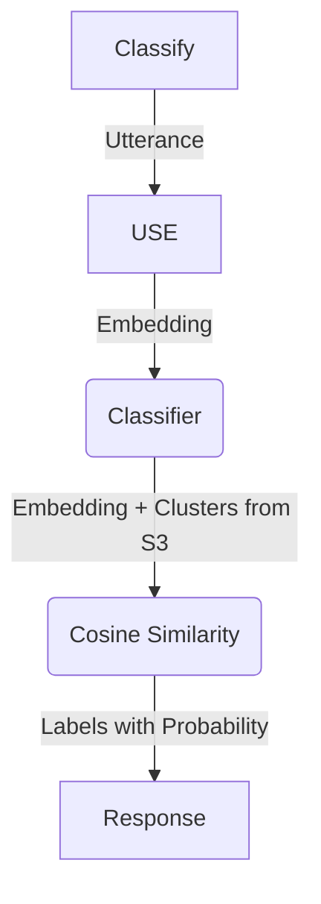
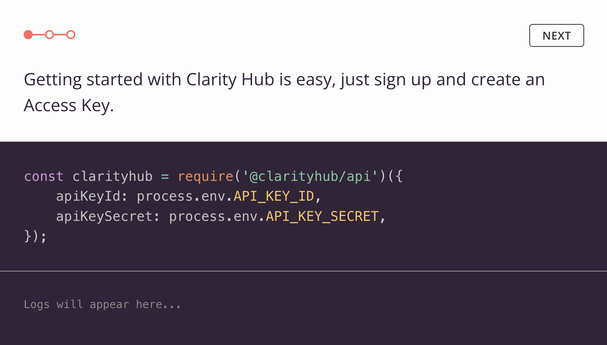
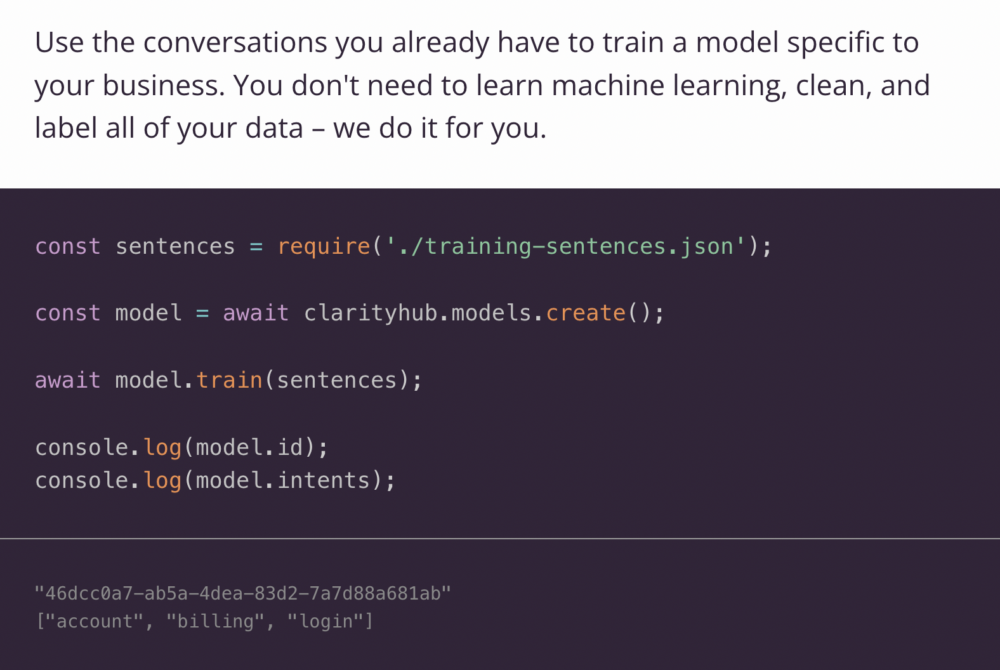
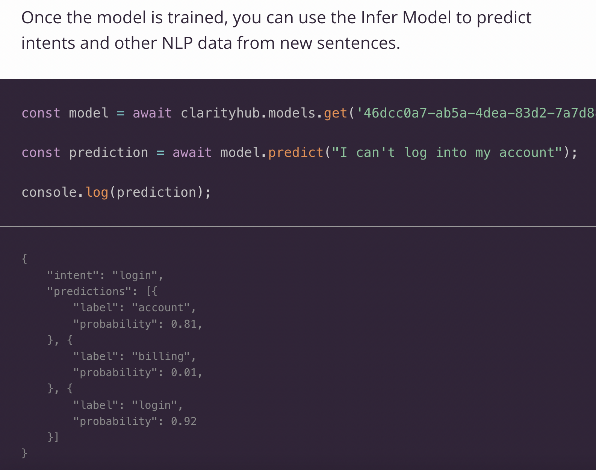

While working on Clarity Hub, we created a Clarity Hub Infer API along with a developer portal that would let anyone create infer models.

The Clarity Hub Infer API provides a fast and intuitive way to create, manage, and deploy NLP models based on labelling utterances.

At the most basic level, the Infer API would let users send utterances via an API and get toxicity analysis, sentiment scores, and simple NLP data like nouns and topics from the utterances.

The power of the Infer API is that consumers can supply a set of pre-labelled utterances to the API, and the API will create a model from this, even if there are only a few utterances used for training. Then the consumer can send a new utterance get a label using that model.

The NLP APIs at Clarity Hub were a set of APIs:

The Consumer would user the Infer API which provided APIs for training and labeling datasets and getting toxicity and sentiment analyses. the Clarity Hub NLP API contained trained Tensorflow datasets for creating embeddings via the Universal Sentence Encoder (USE).

An **embedding** a vector that represents an utterance - a sentence, sentence fragment, or paragraph of text.

Training would involve a consumer sending a payload of utterances with labels to the Infer API, which would call the NLP API internally to create embeddings. We then clustered these embeddings to and re-labelled the clusters using the given labels. If no label was found for an utterance cluster, we attempted to pull a topic out of the utterances to re-label it.

The clusters with labels were then stored into S3.

To classify a new utterance, we created an embedding from it, loaded the existing dataset in, then ran cosine similarity to find the most probabilistic matches:

### What it looked like

### Conclusion

With ChatGPT and other NLP models coming out lately, this seems fairly basic, but the following processes are still very useful to understand:

- Convert language to a representation that is easier to work with, like a vector.
- Clustering vectors is a great way to find representative vectors, reducing the size of the number of vectors you need to work with.
- Cosine Similarity can be used to find how similar vectors are. If a vector is labelled with metadata, it also tells you how similar the metadata between the vectors are as well.

You can see [my project page](/projects/2020-05-18-clarity-hub-infer) for more details and links to the Github repos.
