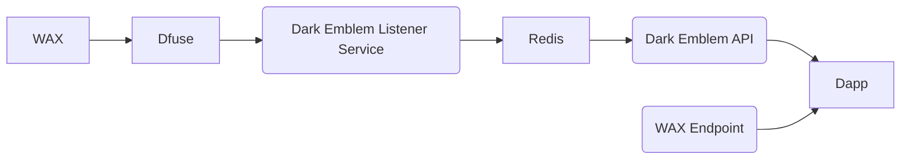
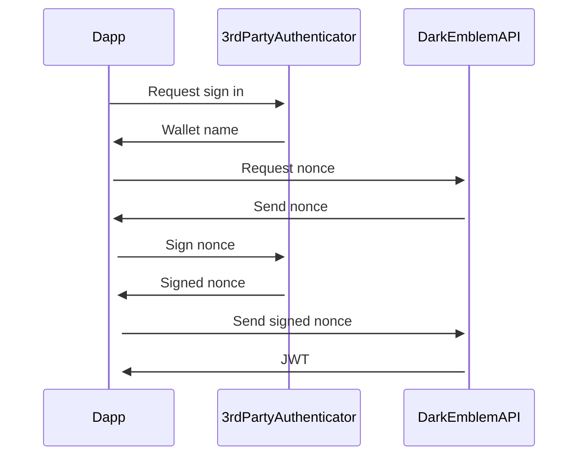
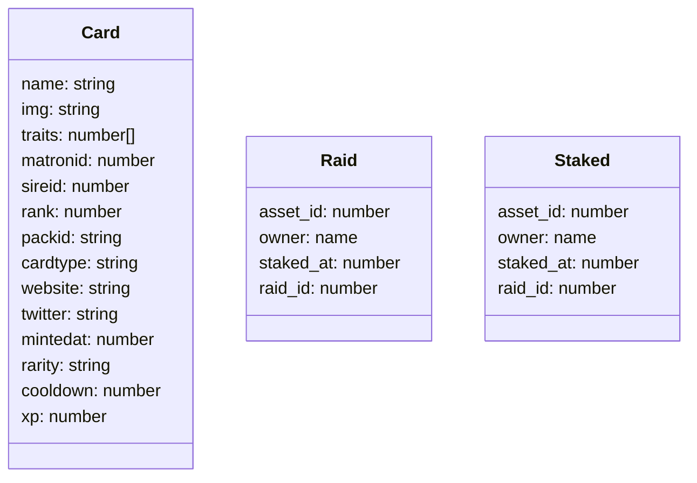

Dark Emblem is an NFT project that was sparked by the idea of combining cards games with Crypto Kitties. You can buy packs, open them to collect random cards, and then use those cards to battle raids with others.

To support all of the functionality, I created a WAX contract, written in C++, that I deployed to the WAX Blockchain. This contract handled the creation and storage of packs and cards, along with defining an in-game currency DREM.

There was also a server that would sync with the changes on the Blockchain and provide some additional metadata on top of that. While Blockchains like ETH have stable public APIs that can be used to query data from the Blockchain through 3rd party vendors, WAX does not have the same maturity there. This meant that we would need to proxy requests that would normally be made to a WAX API mode through our servers instead.

I also created a UI application to interact with the server and the Blockchain. The infrastructure ends up looking like:

One of the first steps to interacting with the dapp is to sign in. The authentication flow is similar to an oauth sign in where we let the user sign in with a third party authenticator and then issue a challenge for the user to verify they are who they say they are. At this point we issue a JWT for further API requests.

Once a user is logged in, they can fully interact with the Dark Emblem WAX contract via the UI. They can purchase packs, open them to get cards, and then use those cards in the Dark Emblem universe. The UI lets users combine Hero cards together to “Ascend” them into a new card. Or they can burn 3 Equipment cards to “Transmogrify” them into a single, better equipment card.

Users can also participate in Raids, where they stake their cards to defeat an enemy monster – gaining $DREM and XP when they beat the monster.

Dapp Schemas and Atomic Assets

The Dark Emblem project involves a lot of moving parts, and I’d love to dive deeper into each technical aspect in future blog posts.

## Additional reading

* [Dark Emblem Blog Announcement](https://www.darkemblem.com/blog/post/2023-04-02-new-site-released)
* [Capsule Cat Announcement](https://capsulecat.com/blog/04-02-2023-dark-emblem-update/)
