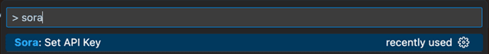

Github Copilot and other AI tools are hitting the scene. I decided to create my own Visual Studio Code extension, which is designed to use OpenAI’s APIs to bring some additional ChatGPT functionality into the code editor. The goal with Sora was to enable a developer to thoughtfully write a comment about the code they would like the AI to write, and then commit to it – rather than the real-time typeahead that Github Copilot provides.

With that goal in mind, Sora provides two ways to activate OpenAI: by typing `@OpenAI` (formally `@ChatGPT`) or clicking “Send to OpenAI” when hovering over a comment. The other improvement is that Sora will read any relative link references to files in your project. A great way to use this is to have OpenAI write code in the style that already exists in your project, for example:

```tsx
/**
 * Write tests for [my-file](./my-file.ts] using
 * [other-test](../something/other-file.test.ts) as an example
 */
```

Using this extension lets users write specifications as comments, and have ChatGPT write the entire file for you.


This extension leverages the OpenAI API to send any referenced files and a starting prompt to the `gpt-3.5-turbo` chat completion endpoint. The prompt mainly sets the context for creating working code using a given language and reference files.

Once the response comes back, the extension parses it and appends it to the original file.

## **Installation and Usage**

You can install the extension by going to [the VSCode Marketplace](https://marketplace.visualstudio.com/items?itemName=CapsuleCat.sora-by-capsule-cat), or searching for “Sora” in Visual Studio Code extensions.

Once installed, you will need to enter your own OpenAI API key. You can get your key by following [these instructions](https://help.openai.com/en/articles/4936850-where-do-i-find-my-secret-api-key). Then just enter `Sora: Set API Key` into the Visual Studio Code command prompt.



You can review the code [on Github](https://github.com/CapsuleCat/sora-by-capsule-cat).

## **Conclusion**

It was fun building my first extension. Please feel free to reach out on our [Github](https://github.com/CapsuleCat/sora-by-capsule-cat) for feedback or questions.
