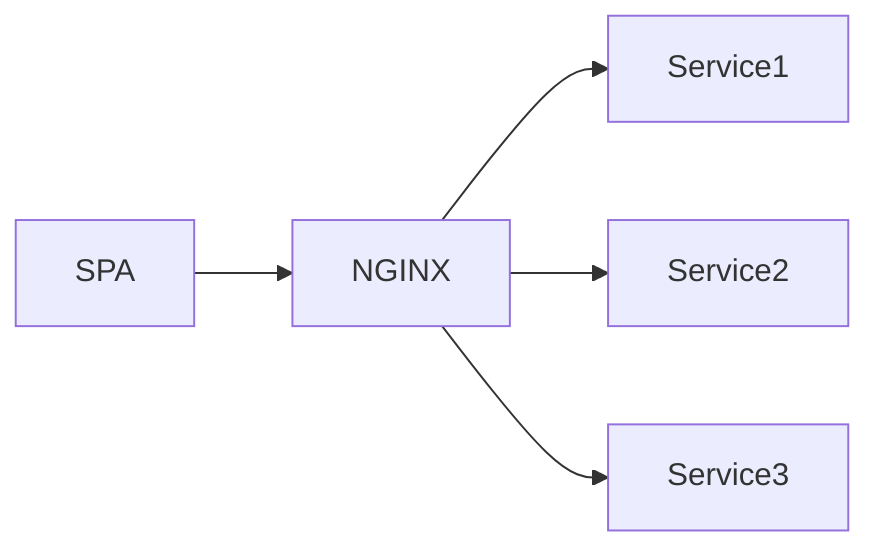
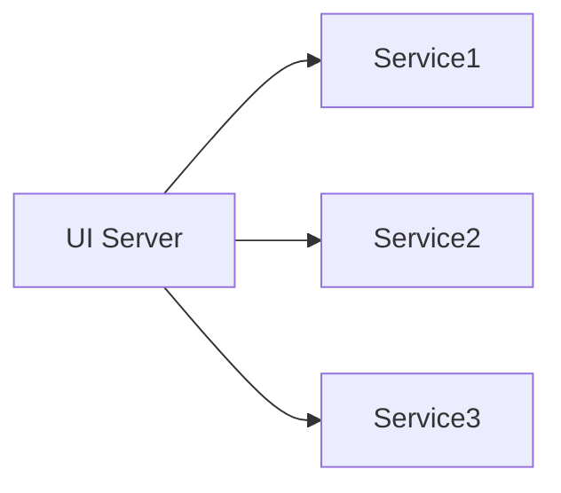
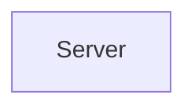

The Backend for the Frontend (BEFFE) is typically stateless and acts as a proxy for other services, including authentication, authorization, and core services. The recent divorce of browser code being rendered by backend services was created by SPAs - Single Page Applications. In simpler architectures, a SPA and service could be as simple as:

SPAs also became popular because the codebase could be built into static assets that could be services.

However, as complexity arises with the above architecture and the SPA starts to rely on more services, a thin proxy is typically introduced, like NGINX:

While proxies like NGINX can continue to be useful, using it as a proxy ends up putting a lot of routing and additional API handling logic on the client. The client now ends up also having to support, understand, and embed how to interact with the data rom all the downstream services. To simplify and create consistent contracts with the UI, we can create a proxy service: a Backend for the Frontend:

The Backend for the Frontend ends up serving two purposes:

- It acts as a proxy for all UI requests
- It manages and massages the APIs of downstream services to be a consistent API for the UI.

When building a UI, only a single service that acts like an API Gateway is required to understand and encode within the application.

The Backend for the Frontend model also allows engineers working on services to separate logic for the UI with the logic from an internal service. An internal service can rely on the Backend for the Frontend to handle things like Authentication, Authorization, Caching, and Rate-limits. These mechanisms may also be implemented as independent services, but the Backend for the Frontend can make multiple API calls per any API request from the UI.

## Moving away from SPAs

A newer development in the UI space is server side render the application. If we are already introducing additional complexity by having a Backend for the Frontend, then why not combine the UI code with the backend service and generate hydrated and cacheable pages via the server instead of using a SPA?

With this design, we increase the complexity - the backend not has to be able to render the UI code. It must now render, hydrate, make requests to downstream APIs, and send those server-side rendered pages to the browser.

But this additional complexity enabled us to:

- create truly authenticated and authorized routes – the code for those routes isn’t even streamed to the browser, unlike a SPA.
- near instant page loads – reducing the bundle size by just sending the JavaScript needed to run the page makes this possible. And since API calls are happening within the same network, this saves the user from additional loading spinners after the initial bundle has been loaded.

The general trend of having a Backend for the Frontend comes with additional complexity. It stems from the want to enhance the experience of the user, and probably from a subconscious desire to return to a simpler time:

