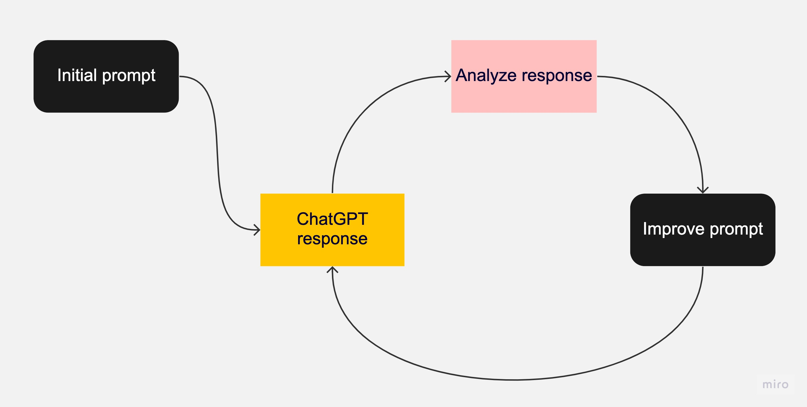
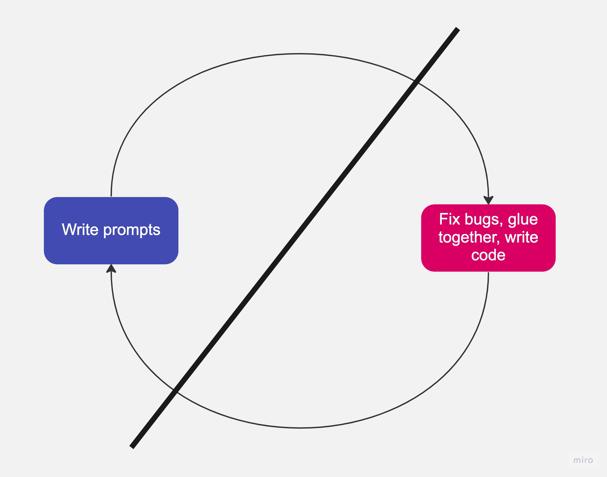

I’ve been experimenting with ChatGPT, just like everyone else. But why has it become so popular? It truly is a revolutionary piece of technology. Is it The Next Big Thing? Will it really replace all of us?

My day to day is architecture and programming, and I’ve heard all sorts of things on Twitter:

- That ChatGPT can build entire iOS applications
- ChatGPT can write whole files of code
- ChatGPT can find bugs in code when writing tests

When I started by own company Clarity Hub, we had a focus on machine learning to help augment human intelligence. My thought at the time was that we could leverage machine learning to augment and supplement human intelligence. The focus wouldn't be to replace any person's job, but to make it streamlined and easier to accomplish that job. Our journey started with us serving customer success agents with suggested replies and contextual information, but we eventually pivoted to a Dovetail-like application to help product teams gather, annotate, and contextualize customer interviews.

We found that augmenting activity with machine learning was not only easier to do from a technology point of view, but empowered users, rather than make them feel like their job was being replaced.

Even with the advent of ChatGPT, I still see this being the short term future of it's use.

## False Starts

I was curious how much ChatGPT could really do given all of its hype  

I asked it to build an Asteroids game using PhaserJS. Don’t worry, this isn’t another article on “Look, I got ChatGPT to build a game!”

I originally just asked ChatGPT to build an Asteroids game using PhaserJS. A very vague prompt, yes, but a great starting point to figure out the limitations of ChatGPT.

The response was basically, “No I can’t”:

> As an AI language model, I'm not able to write and execute code in real-time. However, I can provide you with a detailed framework to get started with creating an Asteroids game in PhaserJS.

This was followed by instructions on how I could do it myself.

The next steps of course are to be more specific, asking ChatGPT to build the application to build specific functionality:

> Add the code to let the player shoot asteroids. If the player gets hit by 3 asteroids, its game over

Most interactions with ChatGPT seem to go like this:

This flow eventually leads to either:

- Not getting what you want.
- Getting what you want across many different responses, and then you must manually coalesce all of the different responses together to form the result you want.

Once I like the set of responses that ChatGPT has given me, I’ll ask ChatGPT to summarize for me so that I can improve the prompt further:

> Take everything we just talked about and give me a prompt to ask you in the future that encapsulates all of the requirements.

## A More Natural Flow

I’ve talked with ChatGPT on a variety of topics, but the majority of questions relate to coding. I actively use Github Copilot, which utilizes the ChatGPT engine in the backend. I’ve built [Sora by Capsule Cat](https://marketplace.visualstudio.com/items?itemName=CapsuleCat.sora-by-capsule-cat) to have ChatGPT generate entire coding files for me as well with project context. Even then, I still use the ChatGPT UI as well.

I find that the above flow leaves me less fatigued, and more productive - at least in the context of side-projects that I’ve used ChatGPT. Research shows that when we read code and attempt logic puzzles, we use a completely different part of our brain than when we use language [[link](https://hub.jhu.edu/2020/12/17/brain-activity-while-reading-code/)]. In the above chart, you can imagine that when we write prompts, we utilize some logical reasoning, but we lean heavily on language as we talk with ChatGPT. Then when we get a response, a completely different part of the brain kicks in to read and write code.

## The Hard Part About Coding

Eventually this leads to “the hard part about coding” which anecdotally everyone will tell you that surprise, it isn’t the coding part. What is nice about ChatGPT though is that even though the hard part isn’t writing code, it does take time, thought, and energy.

If the hard part of coding isn’t coding, then what is it? The non-exhaustive list is that it’s teamwork, communication, debugging, and requirements gathering. Oversimplifying, it’s the writing prompts part of the chart.
