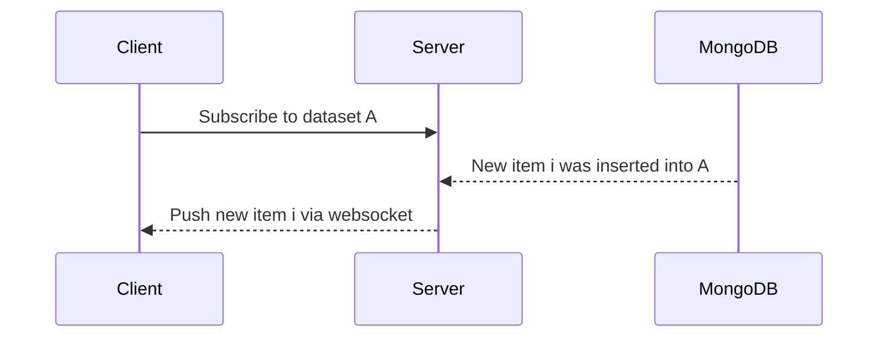
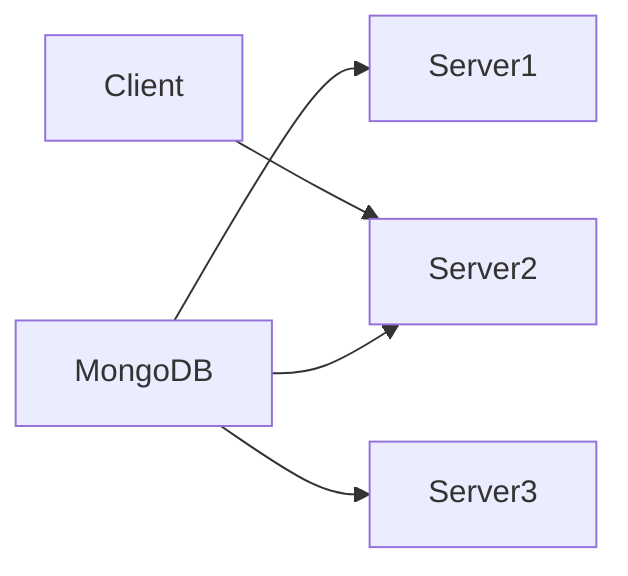

Back when [Meteor](https://www.meteor.com/) was in vogue, they popularized the concept of “Data on the wire”. This was the idea that the UI would be updated with changes from the dataset it is subscribed to.

> Data on the wire refers mostly to the way that Meteor forms a websocket connection to the server on page load and then transfers the data needed over that connection.
>
> The websocket is a live connection and as the data changes, the updates are automatically pushed over the wire and the client updates in real time. (Similar to how many people can edit the same document simultaneously in Google Docs and see each others changes in real time)
>

- [coagmano on Stackoverflow](https://stackoverflow.com/questions/48512242/in-meteor-what-does-data-on-the-wire-mean)

This idea was pretty interesting: a UI could always be considered up to date even if another client created a new row in the database. This is because Meteor would listen to the changelog of the MongoDB it was connected to, and then if a client was subscribed to the dataset that change belonged it, Meteor would push that change over the connected websocket.

Data on the wire enabled clients to stay up-to-date with any changes and create an amazing experience for users who would see changes instantly. For developers, this was also a huge win for prototyping applications.

But the problem with data on the wire is that the client can subscribe to a dataset with additional MongoDB filters, but the server now needs to keep track of what clients are subscribed to what subset of data.

If we start with a dataset `A`, and a user creates a new item `i`, then we know that if a user is subscribed to dataset `A`, we can just send the changes for `i` via a websocket.

But if we want to start scaling our servers up, then we must broadcast any change to dataset `A` to every service, and then each service must check if any websocket is subscribed to `A`:

(Technically, each server would either read from the MongoDB change stream, or have a service push an event to them that is listening to the change stream)

Now, each Service needs to additionally check if the item `i` meets any additional filter criteria that each subscriber may have for dataset `A`.

As datasets grow and filters become more computationally expensive, this can cause a lot of processing and memory burden for each Server.

This is such a problem that it is even called out in the Meteor documentation: **Scaling Updates**.

> As previously mentioned, Meteor uses MongoDB’s Oplog to identify which changes to apply to which publication. Each change to the database is processed by every Meteor server, so frequent changes can result in high CPU usage across the board. At the same time, your database will come under higher load as all your servers keep fetching data from the oplog.
>

I’ve just thought about this recently since I had a conversation about keeping UI’s up-to-date with realtime data based on subscribing to that dataset via a websocket and it sounded eerily familiar to problems I have seen in the past.

In fact, similarly, I’ve seen trouble with GraphQL Subscriptions having similar issues, since each server node now needs to identify when to push data back to a subscriber:

> GraphQL Subscriptions (GQLS) are a mechanism which allow clients to subscribe to changes in a piece of data from the server, and get notified whenever that data changes.
>

[The relay spec](https://relay.dev/docs/v13.0.0/guided-tour/updating-data/graphql-subscriptions/) makes no mention of how a server might do this though. There is a handy tutorial by LogRocket on implementing a NodeJS server to handle subscriptions though: [GraphQL Subscriptions with NodeJS and Express](https://blog.logrocket.com/graphql-subscriptions-nodejs-express/).

But if you look at the diagrams, they seem awfully familiar…
