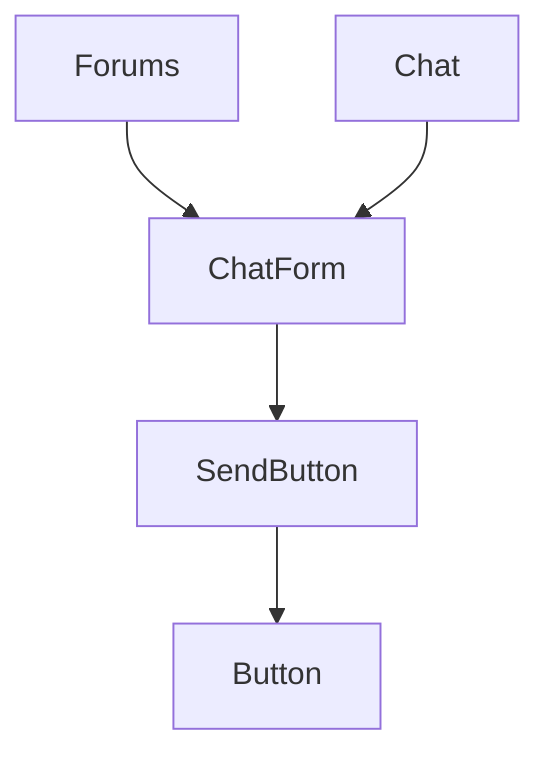

A common pattern in larger application when trying to track feature usage is to try to namespace events. For example, you might have a button that you want to track clicks on. For the sake of this article, we will use the `data-track` attribute on elements to track their usage, but you can imagine this works with any tracking implementation where you may need to explicitly call a tracking function (e.g. `track(namespace)`).

## Simple Example

As requests to start tracking user events come up, typically the easiest way is to just hard code the tracking namespaces:

```tsx
<button data-track="chat.form.send">Send<button>
```

And as the tracking grows, these might get moved to a separate file and a constant/enumeration:

```tsx
const ChatTracking = {
  send: 'chat.form.send',
  attachMedia: 'chat.form.attachMedia',
  edit: 'chat.messages.edit',
  delete: 'chat.messages.delete',
} as const;

// usage

<button data-track={ChatTracking.send}>Send</button>
```

We have a lot of string duplication here. We might be tempted to use template strings or some other way of creating the string, but it doesn’t end up reducing any of the duplication.

## Passing Namespaces

As the application grows more complex, an engineer working on another set of features ends up wanting to re-use the chat form from above. It already has some additional animation and composes together the component library widgets, why not re-use it in the context of forums.

Except now the `data-track` attribute has to be passed in as a prop:



The Forums usage ends up adding its own tracking attribute, but ends up having to prop-drill down the namespace from the Forums components, through the ChatForm, to the SendButton component.

## Using Context

Instead, what if we wrap our features in some Context component that helps us track where our components are being used. Then we can just build up the tracking namespace based on where the component is in the feature tree, rather than having to keep track of long namespace strings.

First let’s build a context in React:

**FeatureContext.tsx**

```tsx
import { createContext } from 'react';

/**
 * Context for tracking features
 */
export const FeatureContext = createContext<string[]>([]);
```

Then we’ll create a helper component that we can use throughout the application:

**Feature.tsx**

```tsx
import type { ReactNode } from 'react';
import { useContext, useMemo } from 'react';
import { FeatureContext } from './FeatureContext';

export interface FeatureProps {
    readonly name: string;
    readonly children: ReactNode;
    readonly topLevel?: boolean;
}

export function Feature({
    name,
    children,
    topLevel,
}: FeatureProps): JSX.Element {
    const parentContext = useContext(FeatureContext);

    const currentContext = useMemo(() => {
        if (topLevel === true) {
            return [name];
        }
        return [...parentContext, name];
    }, [parentContext, name, topLevel]);

    return (
        <FeatureContext.Provider value={currentContext}>
            {children}
        </FeatureContext.Provider>
    );
}
```

Usage of this component would look like:

```tsx
function Forums() {
  return (
    <Feature name="forums">
      <ChatForm />
    </Feature>
  );
}

function Chat() {
  return (
    <Feature name="chat">
      <ChatForm />
    </Feature>
  );
}

function ChatForm() {
  return (
    <Feature name="form">
      <SendButton />
    </Feature>
  );
}

```

Then, in SendButton, when we actually need to use the feature context, we construct the namespace:

**SendButton.tsx**

```tsx
function SendButton() {
  const featureContext = useContext(FeatureContext);

  return (
    <button data-track={[...featureContext, 'send'].join('.')}>Send</button>
  );
}
```

Note: the above example has been simplified for this article’s sake. Typically some utility for reading the context, joining the namespaces, and memoizing the value would be provided.

No additional props are needed, and the Feature components can be used throughout the application as a standard mechanism for building up feature namespaces.

## Conclusion

Rather than trying to alleviate string duplication and prop-drilling as separate problems, we can leverage React Context to solve both problems at the same time and leverage context to determine where we are in a feature tree. Not only does the Feature context help with constructing the data-track attributes, but it now provides a consistent mechanism that we can use throughout the application to let components know the feature namespace they are currently in without the parent components prop-drilling the namespace down to every component.
