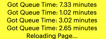
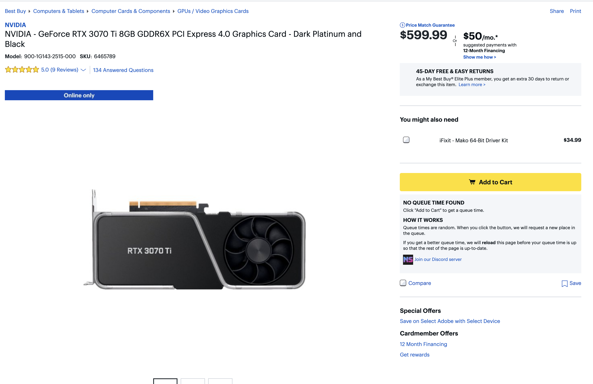
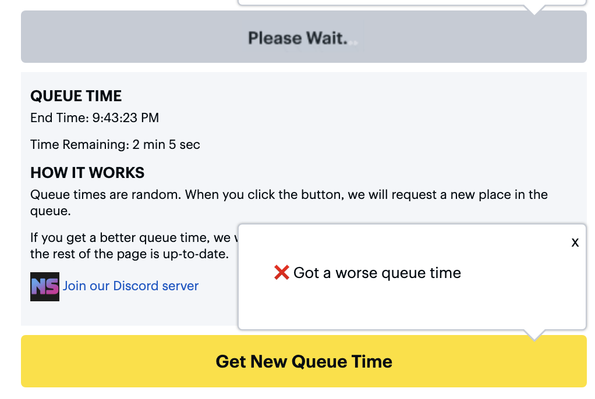

At the height of the GPU craze, around 2021, when everyone was holed up in their homes due to COVID, the 30 series of Nvidia GPUs was extremely difficult to purchase. The scarcity was due to a few factors: the COVID pandemic had disrupted supply chains across the world, Taiwan was experiencing a severe drought that was impacting chip production, and cryptocurrency, especially ETH, was gaining value, making mining it was the latest GPU series incredibly lucrative.

<!--tuncate-->

Since the supply was low and demand was high, this created two types of markets: one was the second hand market for GPUs where an \$800 GPU could go for \$3500 in cash when sold to someone mining cryptocurrency. Because of the massive mark up, buying and selling software to automate the process of buying GPUs when they "dropped" on a site was also growing as a market. These were called "bots" in the community, where customers trying to get a single GPU for their gaming PC were competing against hundreds of not thousands of bots flooding websites when they dropped. Common sites like Nvidia, AMD, Best Buy, and Zotac would get flooded with millions of requests when they added GPU stock the site.

To combat this, different market places tried different techniques to verify that humans were the ones trying to access the site. But due to time constraints, these never seemed to be properly implemented.

Zotac added a Cloudflare verification to their site that would try to verify that a user was real. The setting they used though attempted to not disrupt real users, but only issue a challenge to visitors it deemed “bots”. A puppeteer script could easily bypass this by first visiting other sites that used cloud flare (but didn't issue challenges) and then visiting the Zotac site. A fresh puppeteer instance would be issued a challenge, but one that visited other sites before would not.

There were other tricks people used to help them attempt to secure GPUs. My favorite was adding a Zotac TShirt to your cart before a drop so that you could input all of your shipping and payment information. Then when a drop was detected, you’d simply issue the add to cart API call, and then the checkout API call. This would bypass the checkout walkthrough. When the website was flooded with millions of API calls, you only needed two API calls to succeed, rather than 10 or more.

Automating this way worked so well that a puppeteer script that I wrote was able to add 4 GPUs to one cart, send me a Pushbullet notification to wake me up in the middle of the night, and I just had to click one last step to verify the checkout manually since I didn't trust a script with actually making card payments on my behalf.

Zotac did finally learn from this and finally upped the Cloudflare bot check to issue a challenge to all users during the rest of the 30 series release. They also released a new site that made it harder to track when GPU stock was released.

Best Buy must have had many complaints about the terrible system they had. Any GPU stock they had would almost immediately be gone by the time s human would show up to try to purchase one. At the time, they had a graphql-like API that allowed anyone to request with any frequency the in-stock status of any number of skus on their system. If you used puppeteer to visit the site, grab the cookies, and then issue an API request to this API, you could consistently check the status of all GPU skus every 5 or so seconds for the entire day. No rate limits, no other form of authentication other than public cookies.

So that explained how bots were able to detect GPUs so quickly and with no form of bot checking or challenge system, once the GPU was in someone's cart, it was very easy to checkout since the Best Buy site would continue to work even when flooded with requests.

To mitigate this, some poor group of developers was tasked with creating a queue system. I'm guessing the time crunch was real because when I went to investigate how this queue worked, it was entirely determined by the user cookie that was issued.

Here's how the queue worked for the end user: the user would get a notification from their favorite discord server that there was a drop (since the graphql-like endpoint was still available). They would go to the page for the GPU they wanted to purchase and click “add to cart”. The button would then change to a “waiting in queue” message and be disabled. There was no indication how long that queue would be. Then after some time, the button would change back to “add to cart”. The user clicks it, and if there was still stock, the GPU would be added to cart. Then the user needed to quickly checkout before the stock ran out.

I was really curious on the part where there was no indication of how long the queue was. When testing using a 5950 AMD CPU that still had stock, but had the queue system enabled, I determined that the wait time was effectively random. It didn't matter if you were the first one to click that button, it would just assign a random queue time to you before you could cart the item.

I ran more tests. I recorded a small sample of wait times and they would vary from a minute to over an hour.

I decided to investigate what code determined when the button changed back to “add to cart”. No API calls were made while waiting in queue. Huh okay so the browser code already knows how long the queue time is.

The UI code on the Best Buy site is not just minified, but also mangled. This process will replace function names, introduce additional function calls to obfuscate what functions are doing, and generally makes it very difficult to debug. After tracing back what changed the button and the call stack, I was able to finally piece together how the queue time was determined.

When a user visited the best buy site, they were issued a public cookie. It looked like a special UUID. The middle section of the UUID must have some special properties to meet some hash check value from what I could tell. The point is that I must have had some guaranteed randomness to it that gave the developers the idea to reuse this section to deterministically evaluate a queue time on both the browser and the server.

I created a browser extension to test the hypothesis:

1. Show the queue time for the current cookie on the page by injecting some HTML.
2. Add a button to “roll for a better queue time”. This would issue a request to get 20 new cookies, figure out which queue time was best, set the browser cookie to that cookies and display the new queue time.

I tested with the 5950 CPU and saw my queue time go from 30 minutes to 1 minute. Success!

I had a close group of friends that I rolled this out to. The next Best Buy drop happened and we were all able to get the founders edition cards. Finally!

There was a popular bot net that effectively did the same thing. I don't know if they knew how to calculate the queue times, but they would spin up 20+ browsers with the best buy site and wait for the first one to have the add to cart button, and then give the purchaser of the bot net subscription the cookies for that session.

Times were dire and I thought this approach from best buy was garbage. It effectively made individuals - who might have stood a chance before - now have to wait some random amount of time against those with those who had hundreds of bots trying to get a good queue time.

Conveniently someone reached out to me to commission a chrome extension related to getting GPUs. They wanted to know what was possible and I told them I figured out the queue system times, and how an average person could get a better queue time. We released a branded version of my extension and some 10,000 people downloaded it.

And then I waited for the next Best Buy drop.

The alert went out that there was stock.

And the website crashed 20 seconds into the drop.

I was actually surprised since their site had done so well before. But I guess people rolling for new cookies 20 times in a second was enough to bring the site down momentarily.

After that drop, Best Buy held off on GPU drops for over a month. When the next drop finally happened, they had changed the queue system slightly. The cookie was no longer the source for the queue time, and rolling for a new cookie did not give you a new queue time. Finally.

Your queue position was still effectively random, but at least it could no longer be gamed by requesting new sessions. Not could you know your queue time even if you did ask for new sessions.

Props to Best Buy for continuing to experience with this too. Pokemon cards are the new drops and they force people to use the mobile app now to request a time in queue.
