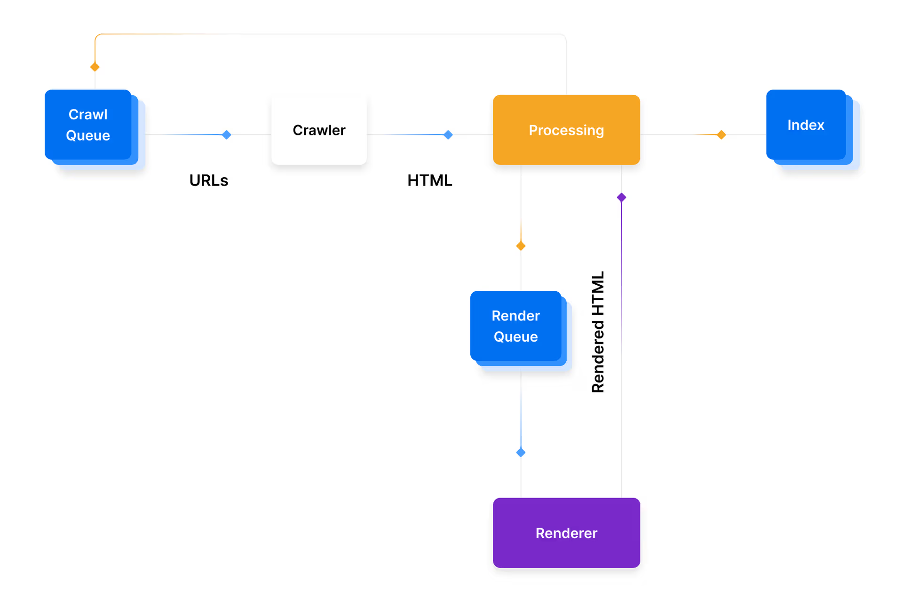

What happens to SEO when the crawler itself becomes one of your primary consumers?

We all intuitively know how SEO is supposed to work. Google and other search engines have been working for decades to make sure that search returns high quality content, rather than spam that stuffs the page with keywords. We would write meaningful, quality content, and Google with crawl the page, index the data, and humans would search and visit the website.

We built the modern web around the assumption that crawlers are lightweight readers of web pages. Increasingly, they are behaving more like automated users. With [53% percent of traffic](https://www.imperva.com/blog/bad-bot-report-2026-bots-agentic-age) is bot traffic on the internet, how we write web applications, serve them, and the end goal of SEO may be changing.

<Separator />

When we launched the new version of Couchsurfing, we expected all sorts of issues. We anticipated a large spike in traffic when we launched, even though we weren’t planning on any immediate marketing push. But what we didn’t expect was to continue to see large spikes in traffic after we launched. These spikes wouldn’t just get a web page via a cURL GET request, but they would request all the different locales, all the image assets on the page, and all the other assets on the page. Some of the traffic we looked at would even attempt to create URLs that didn’t exist in our web application, hammering us with requests that we would 404. These weren’t from Googlebot. These were tons of other crawlers that were scraping our site for information - [Claudebot](https://claude.com/), [meta](https://meta.com/), other nefarious bots that would not return correct User Agent strings.

Why were AI crawlers hitting the application so differently from Google bot?

<Separator />

To understand why this was so surprising, we have to understand who the site was originally designed for. 

When we started thinking about the next version of Couchsurfing, we decided that we would want to focus on “SSR” - Server Side Rendering” - as much of the page as possible. That is essentially how the existing application worked and we wanted to make sure the majority of the page wouldn’t have cascading loaders like Single Page Applications often have. We also knew wanted to move the application into React. The previous team had already tried implementing a few React components into the application, but it was slow progress.

With SSR and React as the baseline of what we wanted for the web application, we settled on NextJS as the framework. From there, every product kick-off would start with a few key questions: is this a public facing feature or page? And how much of it should be server-side rendered?

During the inception of this new project, there was quite a lot of discussion by Vercel, Next.js and web engineering at large about how much SSR was really required. 

[NextJS](https://nextjs.org/learn/seo/webcrawlers) and [Google Search Central](https://developers.google.com/search/docs/crawling-indexing/javascript/javascript-seo-basics) have typically described the indexing process like this:

Where the crawler will have items added to the render queue to actually execute the JS on the page. When we kicked off the project, we assumed that with the number of pages we were going to have to re-index with Google, that this step would take awhile to happen for our site. And when it did happen, we wouldn’t expect all our pages to be rendered in a reasonable timeframe. We estimated that our new multi-sitemap would have millions of pages, rather than the single 500,000 entries we had in the existing sitemap. We would have to worry about the crawl budget, so we settled on SSR’ing as much of the page as possible so that indexing could happen without the rendering step.

But Googlebot wasn’t the problem.

<Separator />

AI Crawlers hammer the application.

Crawling traffic. Thousands, hundreds of thousands of requests a day. We had anticipated Googlebot - the traditional bot that crawls pages to index them for Google search results. And that is the bot we had optimized SEO for. But we saw way more traffic than we expected from other crawl bots. We saw Meta’s bot crawling every single one of our user pages, location pages. We saw claude bot hit every single page in every single language we had localizes We saw weird scrapers that didn’t properly represent themselves try to hit thousand of user pages that required users to be logged in to see.

We were seeing lots of burst traffic. Claudebot for example would suddenly hit us with thousands of requests all at once. Our WAF had 429 rules to tell it to back-off, and we even had additional rate-limits on certain APIs that return 429 as well. This helped when the requests would come from the same IP address, but we would often see these large bursts come from clusters of IP addresses.

Pages would start responding slow due the insane influx of traffic, which wasn’t just to the page it was crawling, but to all the assets on the page, including images, JS files, and additional APIs that the page would normally request once hydrated on the client. This is the opposite of what we had expected - we expected crawling bots to simple do a GET to the page they were requesting and crawl the contents of that page. But crawling traffic for these LLM bots would actually evaluate the page like an end-user - some explicitly using tools like Puppeteer or Playwright according to the request headers.

The crawler was no longer simply requesting the server-side rendered version of the page. Instead the crawlers were acting like full users - hitting the page, requesting all the assets and image, and then following links on that page. Worse, some acted like malicious attacked - trying to enumerate pages that didn’t even exist to see if there was content on them.

<Separator />

Before AI, we would have considered these attacks. After AI, this is the new normal. As one Redditor describes, [The Web Is All Bots Now](https://www.reddit.com/r/webdev/comments/1vy80na/the_web_is_all_bots_now/), which means as engineers we have had to pivot from the old way of thinking about who our pages are serving to this new normal that most of the requests are going to bots.

Even Konstantin Ryabitsev, Director of the Linux Foundation, has come out with a blog post [Creepy Crawlies](https://people.kernel.org/monsieuricon/creepy-crawlies) that details just how much CPU bots are using hitting the git.kernel.org site, using the HTML version of the site instead of more efficient mechanisms:

> TL;DR: we spend more CPU cycles rendering commits for scrapers than we spend on all other kinds of legitimate access, including git clones. At any one time, across 5 geo-distributed nodes, there are 14 CPU cores doing nothing but rendering git commits as html.
> 

At the end of the day, we have to decide from an engineering stand point what we do about this issue. We can rate-limit requests, we can block certain user-agents, and we can set-up robots.txt files with rules. But not all bots are playing by the rules. Some bots aren’t identifying themselves via unique user-agent strings. Some aren’t even looking at robots.txt.

And by blocking some agents, our sites may not be cited by agents, leading to less traffic – which is already decreasing since users are asking agents instead of doing text searches now.

The future is still foggy around SEO and AEO, but the current situation is clear: the majority of traffic on the internet is bots, and that is going to shape how we build and serve apps.
