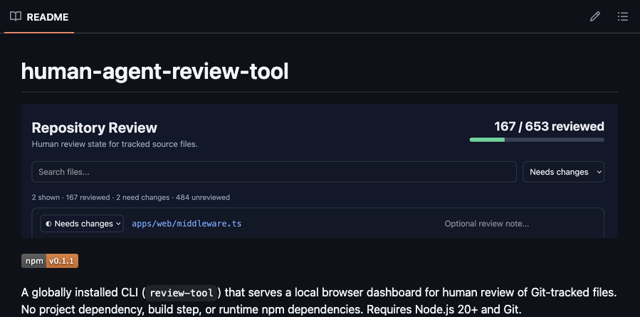
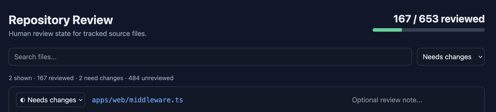

I recently published a utility [Human Agent Review Tool](https://github.com/idmontie/human-agent-review-tool) that helps keep track of the code I've actually reviewed while working with coding agents.



AI coding agents have made it possible to iterate on ideas and features extremely quickly. This is extremely helpful when building proofs of concept, experimenting with ideas, and creating internal scripts and utilities.

But that workflow of working with a coding agent to produce code introduces a simple problem: which files have I actually reviewed?

When using Cursor, each agent workflow typically let's you review files. But this interface is typically all or nothings – once you commit and move onto the next workflow, that diff is gone.

In a traditional workflow, a pull request provides a nice interface and check-in point for code review. When working locally with an agent, I don't necessarily create a PR for every single feature, nor do I want to for work that might be throwaway code.

After several rounds of prompting, testing, and iterating, it can become suprisingly difficult to remember what code changes I have personally looked at.

The Human Agent Review Tool gives a lightweight way to track that.

After globally installing via

```bash
pnpm i -g review-tool
```

you can run `review-tool` from a Git repository and it will open a local dashboard containing all the files in the project. Each file can be marked as Reviewed, Unreviewed, or Needs Changes.



I can also attach notes to the files that need additional work, giving me a simple queue for the next iteration with the coding agent.

The tool tracks the review state separately from the source code, and if a previously reviewed file changes, that review state becomes stale so that it can be reviewed again. It also supports ignoring generated files or other files that aren't useful to inspect manually.

The goal isn't to replace pull requests, or any traditional code review. Rather it is meant to help with the local development workflow that happens before a traditional code review: allowing a human and agent to rapidly build together on a local codebase.

As coding agents become capable of producing larger features and code changes, I think tools that help developers maintain oversight will become increasingly important.

The project is available on Github: https://github.com/idmontie/human-agent-review-tool.
