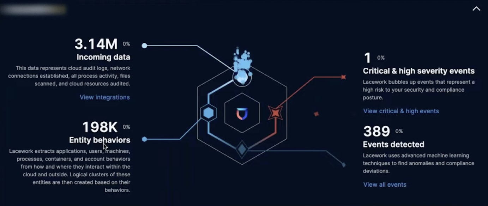
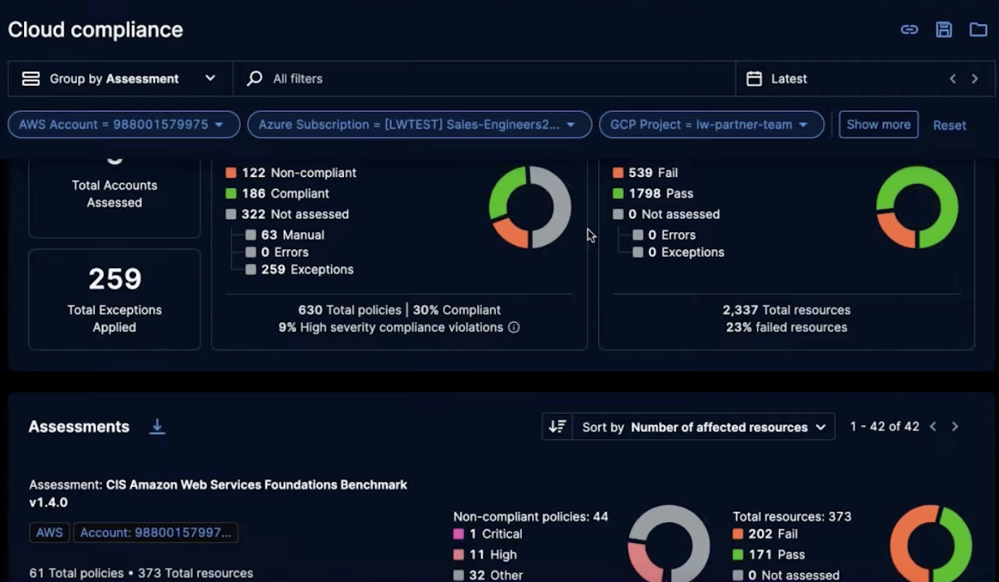
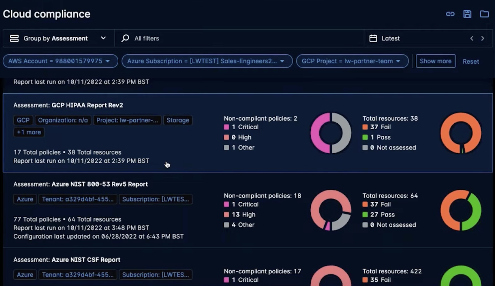
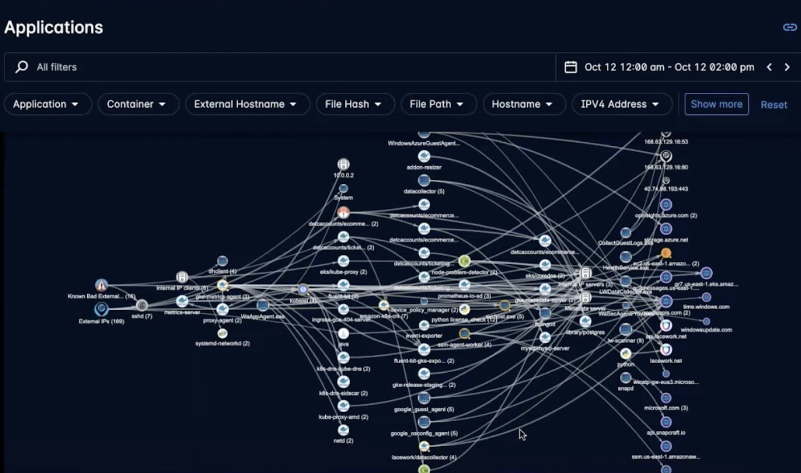

While at Lacework, I worked on implementing entire new product lines for their cloud security offerings. This included architecting, implementing, and continuously delivering new features for Alerting, Identity Management, Resource Management, and Vulnerability Management on the web UI.

My work included revamping the entire web application from the old application design which was created ad-hoc, into a modern and more structured design created by our UX team. As a front-end team
we worked closely with the UX team to ensure the new design was implemented correctly and that the user experience was improved. The application was built with React and Typescript, and the component
library we build our design system on top of was Ant Design.

The landing page would show a summary of the user's cloud security posture, including a summary of the user's cloud security risks, and a summary of the user's cloud security compliance.

The Cloud Compliance page would show a summary grouped by different metrics, such as cloud, assessments, and compliance status. The top of the page would show a summary of that group, along with
any filters that were applied to the data that the user can change.

Below the summary, we would show different assessments that the user can investigate to improve their cloud security posture..

One of the first visualizations built at Lacework was the Polygraph, which was a visualization of all the different entities in a user's cloud environment, even across different cloud platforms and machines.

