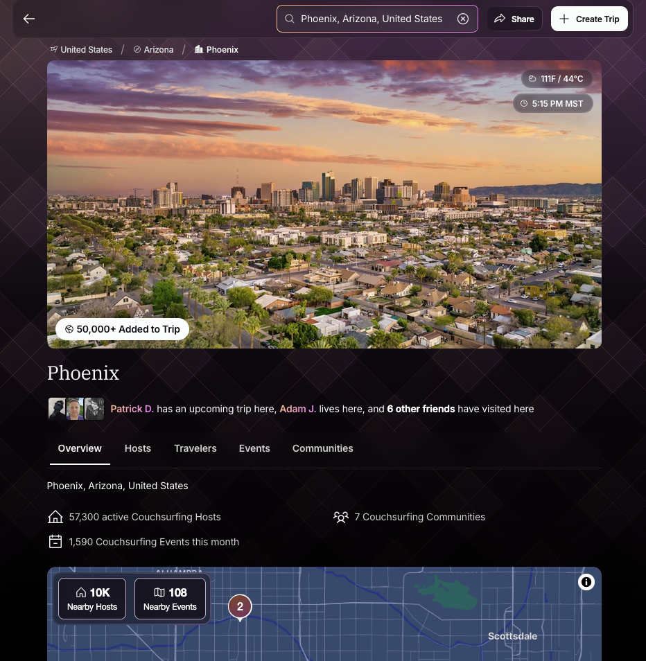
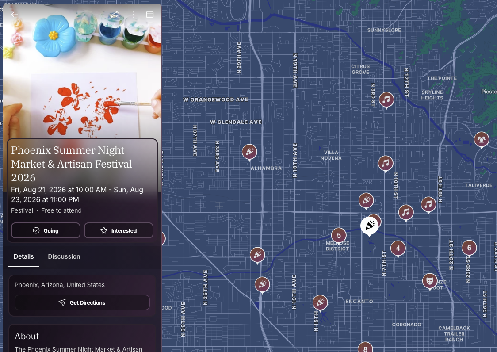
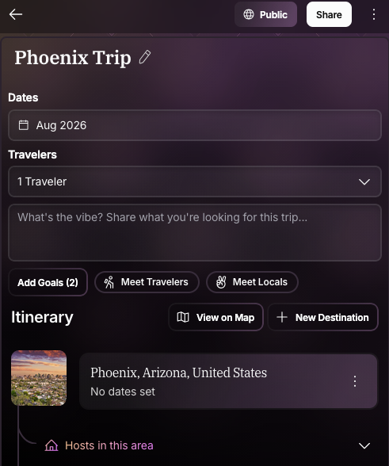

Architected and built Couchsurfing’s next-generation web platform, establishing a modern React, TypeScript, Next.js, Nx, and Node/NestJS architecture to support the company’s transition from its legacy application stack.

Couchsurfing is a global travel platform that connects travelers with local hosts who open their homes to guests for free, creating opportunities for cultural exchange and shared experiences. The platform supports real-time messaging, trip and stay management, host discovery, local events, and destination-specific community experiences. Users could communicate via real-time chat, powered by Stream. This was an enormous improvement over the legacy version of inbox style messaging.

Location pages were powered by merging data from different data sources, including external APIs for weather, timezone, and safety information. We used Mapbox for maps, Flickr for images, and pulled together localized details from our headless-CMS. Users could use location pages to find hosts, travelers, local events, and related communities. Events included those hosted by Couchsurfing users, and those sourced from third-parties.

Our events features allowed users to organize events at a given time and place, see who was going and who was interested, and have discussions about the events.

All of the location details, host information, and events could be managed via trips.
