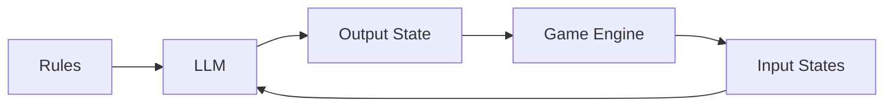

We are starting to see a rise of novel use-cases for AI in products and games using LLMs. Rather than the simple chatbot like experiences we have seen in the past using AI, we are starting to see feedback systems being added to these experiences, providing additional context to the LLM than just the past conversation.

A typical game loop for this type of system would look like:

Rules can be describes as written-word description, with an additional set of rules telling the LLM to reply using JSON output of a given schema. In this area, I have had success giving LLMs descriptions of output schemas in Typescript and asking for a JSON response that adheres to the type. Other methods of getting a consistent schema are more than likely possible here, as well as additional output methods.

When the asynchronous task of creating and output state is complete, the Game Engine in this case can read, parse, and apply that new state to the world. Any additional interaction would then lead to the next set of input states that can be given to the LLM as a JSON blob.

For a more concrete example, we can imagine a game where we want our player to interact with a set of agents. The input states would be the state of each agent, the user’s interaction, and maybe some global environment data. The rules may be how each agent should behave, the rules of the game, and additional context. The LLM would take these inputs, and the output is instructed to be the next state of each agent. When the LLM returns this data, the Game Engine read it and applies it to the game’s representation of each agent, showing the player the impact of their actions.

I’m looking forward to more novel use-cases for LLMs!
