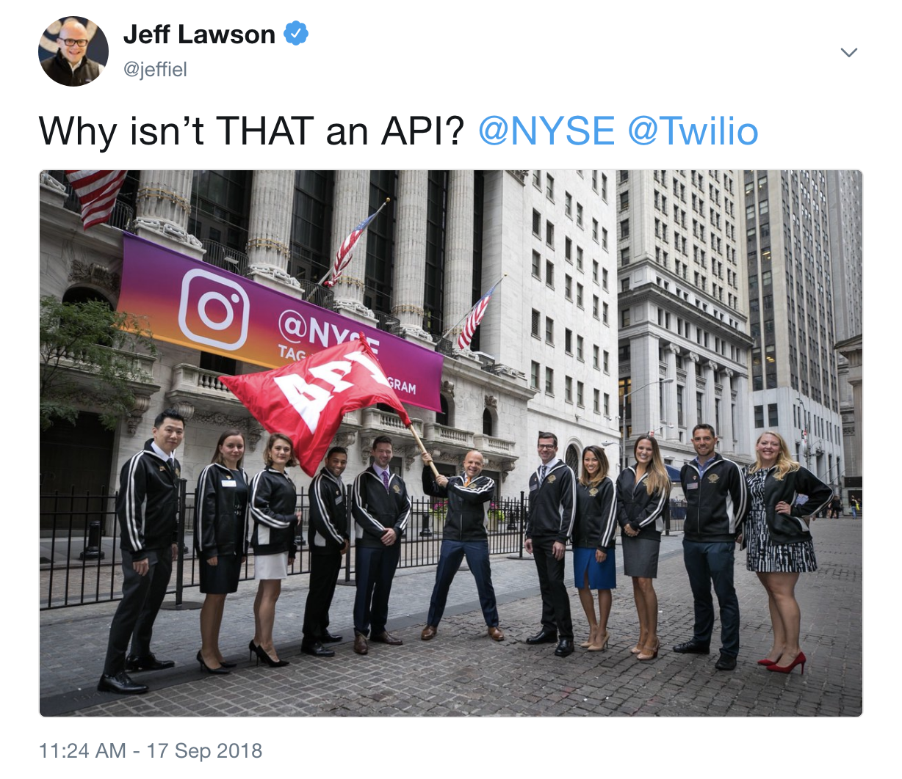

In 2008, Steve Ballmer once famously said “[Developers, developers, developers](https://www.youtube.com/watch?v=Vhh_GeBPOhs)” in a highly meme-able video. He was trying to emphasize the importance of software developers in business and that their importance was only going to continue to grow. Microsoft shifted to try to support software developers, noticing that if they supported developers, they would build better software for Windows, which in turn would make people want to use Windows.

The 2010s saw companies like “Twilio” have guiding questions like Jeff Lawson’s “Why Isn’t That and API?”. This guiding principle was based around the idea that if you build great APIs for software developers, they would want to use them, and in doing so, spend money on those services. For that entire decade, companies would start, build for engineers, and use the fly-wheel effect to become multi-billion dollar companies.

Now, in the age of LLMs (Large Language Models) and AI, my assumption about the future is that we are going to find that “AI Agents” are the next Big Thing. We will probably see software engineers coding not to make APIs that other developers can use, but so that AI Agents can use. With [OpenAI introducing Operator](https://openai.com/index/introducing-operator/), their AI that can do tasks for you autonomously, the trajectory looks clear for companies that want to partner in this space: make products that will interface with AI Agents*.

And this isn’t going to only apply to software engineering. Even those in marketing are starting to think about how their content can be better consumed by the crawlers that feed into the training data for these LLMs. In “[AI Slop Suspicion and Writing Back](https://benjamincongdon.me/blog/2025/01/25/AI-Slop-Suspicion-and-Writing-Back/)”, the author hypothesizes about the future of SEO. Will we be writing not for other people to reach our content via search, but to see our content as part of an LLM’s answer to a question? If people are starting to transition to asking LLMs like ChatGPT a question first before they even Google, then wouldn’t getting your name and your thoughts ingested by the massive corpus of training data be beneficial in a sense, similar to a web-crawler indexing for search?

These are questions I think we will see answered very soon, and some of the answers may not be ones we like. We may very well be starting to write content, apps, and APIs not for other people, but for machines.

*Of course, not everyone is going to jump on this bandwagon. There are companies right now that make concerted efforts to make sure only humans use their site. They don’t have APIs, they stick their entire site behind a Cloudflare captcha check. These aren’t the companies I’m talking about as they weren’t trying to bridge into the larger software developer ecosystem.
